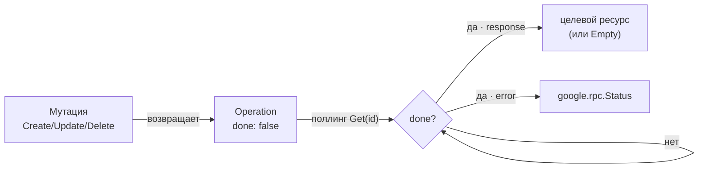

import { ApiOperation } from '@site/src/components/commonBlocks/ApiOperation'
import CodeBlock from '@theme/CodeBlock'
import dedent from 'ts-dedent'

# Operation — асинхронные операции

`Operation` — универсальный контракт долгоживущей операции (long-running operation, LRO). Это тот
самый тип, который возвращает **любая** мутация Kachō (`Create` / `Update` / `Delete` и
action-RPC). Он решает общую для control-plane задачу: мутация почти всегда многошаговая, поэтому
API не блокирует клиента, а сразу отдаёт квитанцию, по которой клиент опрашивает результат.

Пакет — `kacho.cloud.operation` (`proto/kacho/cloud/operation/`).

## Сообщение Operation

<table>
  <thead><tr><th>Поле</th><th>Тип</th><th>Описание</th></tr></thead>
  <tbody>
    <tr><td><code>id</code></td><td>string</td><td>Идентификатор операции (по нему идёт поллинг)</td></tr>
    <tr><td><code>description</code></td><td>string</td><td>Человекочитаемое описание (например «create zone»)</td></tr>
    <tr><td><code>created_at</code></td><td>timestamp</td><td>Момент создания</td></tr>
    <tr><td><code>created_by</code></td><td>string</td><td>Инициатор (сохраняется для обратной совместимости)</td></tr>
    <tr><td><code>modified_at</code></td><td>timestamp</td><td>Время последнего изменения операции</td></tr>
    <tr><td><code>done</code></td><td>bool</td><td><code>false</code> — в процессе; <code>true</code> — завершена (заполнено <code>error</code> или <code>response</code>)</td></tr>
    <tr><td><code>metadata</code></td><td>Any</td><td>Служебные данные (обычно id целевого ресурса); тип документируется у каждого метода</td></tr>
    <tr><td><code>result.error</code></td><td>google.rpc.Status</td><td>Результат при ошибке (oneof)</td></tr>
    <tr><td><code>result.response</code></td><td>Any</td><td>Результат при успехе: целевой ресурс или <code>google.protobuf.Empty</code> для Delete (oneof)</td></tr>
    <tr><td><code>principal_type</code></td><td>string</td><td>Тип инициатора: <code>user</code> / <code>service_account</code> / <code>system</code></td></tr>
    <tr><td><code>principal_id</code></td><td>string</td><td>ID subject'а в IAM или системный токен (<code>bootstrap</code> / <code>system</code>)</td></tr>
    <tr><td><code>principal_display_name</code></td><td>string</td><td>Snapshot отображаемого имени на момент операции (для UI/логов)</td></tr>
  </tbody>
</table>

Инвариант поля `result`: при `done: false` без ошибки — ни `error`, ни `response` не заданы; при
`done: true` — задан **ровно один** из них.

## Жизненный цикл

## OperationService

Поллинг ведётся через `OperationService`. Обратите внимание: REST-путь операций **общий** для всех
доменов — `/operations/…`, без доменного префикса.

### Get — получить операцию

<ApiOperation method="GET" endpoint="/operations/{operation_id}">

Возвращает текущее состояние операции. Клиент опрашивает этот метод, пока `done` не станет `true`.

<CodeBlock language="bash">
  {dedent`
    curl '.../operations/enpXXXXXXXXXXXXXXXX'
  `}
</CodeBlock>

<CodeBlock language="json">
  {dedent`
    {
      "id": "enpXXXXXXXXXXXXXXXX",
      "description": "create network",
      "createdAt": "2026-06-24T10:00:00Z",
      "done": true,
      "response": {
        "@type": "type.googleapis.com/kacho.cloud.vpc.v1.Network",
        "id": "net-abc",
        "name": "prod"
      }
    }
  `}
</CodeBlock>

</ApiOperation>

### Cancel — отменить операцию

<ApiOperation method="POST" endpoint="/operations/{operation_id}:cancel">

Запрашивает отмену выполняющейся операции (best-effort; успех зависит от стадии). Возвращает
текущее состояние `Operation`.

</ApiOperation>

## История операций ресурса

Помимо общего `OperationService.Get(id)`, каждый ресурс отдаёт свою историю через
`<Resource>.ListOperations` (например `GET /vpc/v1/networks/{network_id}/operations`) — это
синхронный пагинируемый список операций, затронувших конкретный ресурс.

## Как переносится principal

Principal-поля (`principal_*`) заполняет auth-interceptor api-gateway после валидации токена, а
worker'ы `kacho-corelib/operations` пробрасывают их в дочерние операции. Это гарантирует, что
цепочка cross-service вызовов внутри одной мутации не теряет инициатора (иначе async-worker ушёл бы
анонимно и authz-Check отклонил бы вызов). Подробнее об authz — [Авторизация](/infra/authz).

## Дальше

- Общая async-модель — [Форма ресурса и Operations](/conventions/resource-shape).
- Как ошибка попадает в `Operation.error` — [Ошибки](/conventions/errors).
