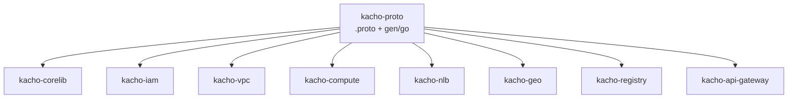

import hero from '@site/src/css/hero.module.css'

<header className={hero.hero}>
   Контракты · API-платформа

  <h1 className={hero.title}>
    Единый дом контрактов 
    Kachō
  </h1>

  

    <strong>kacho-proto</strong> — единственный репозиторий, где живут все <code>.proto</code>-контракты
    платформы: доменные API (IAM, VPC, Compute, Load Balancer, Geo, Registry) и универсальная
    инфраструктура (Operation, validation, authz). Отсюда генерируются готовые Go-SDK, которые
    импортируют все сервисы.
  

  

    <a className={hero.btnPrimary} href="/getting-started">Быстрый старт →</a>
    <a className={hero.btnGhost} href="/conventions/resource-shape">Конвенции</a>
    <a className={hero.btnGhost} href="/domains/overview">Домены</a>
    <a className={hero.btnGhost} href="https://github.com/PRO-Robotech/kacho-proto">GitHub</a>
  

</header>

## Что это и зачем

**Kachō** — самостоятельная облачная control-plane платформа. Её API распределён по доменным
сервисам (IAM, VPC, Compute, Load Balancer, Geo, Registry), но **описание этого API — единое**:
все контракты собраны в одном репозитории `kacho-proto`.

Такое решение закрывает конкретную задачу полирепозиторной разработки: когда каждый сервис живёт
в своём репозитории, контракты легко разъезжаются — версии стубов расходятся, `buf breaking`
некому запустить целиком, SDK для одного домена не видит типов другого. `kacho-proto` устраняет
это в корне:

- **Единый источник истины** — новый `.proto` заводится только здесь, нигде больше.
- **Единая проверка** — `buf lint` и `buf breaking` прогоняются на весь контракт разом.
- **Синхронные версии** — все сервисы собираются против одного набора сгенерированных стубов.
- **Готовые SDK** — Go-код (`protoc-gen-go` + `-go-grpc` + `-grpc-gateway`) коммитится в
  `gen/go/…` и подключается импортом, генерировать локально не нужно.

Это **contract-only** репозиторий: здесь нет бизнес-логики, миграций или БД — только определения
API и вспомогательный код валидации. Реализация каждого домена живёт в своём сервисном
репозитории (`kacho-iam`, `kacho-vpc`, …), а `kacho-proto` даёт им общий словарь.

:::tip С чего начать
Новому читателю — [**Быстрый старт**](/getting-started): как склонировать, прогнать `buf`,
подключить сгенерированный SDK в Go-сервис. Затем — [Конвенции API](/conventions/resource-shape)
(как устроен любой ресурс Kachō) и [каталог доменов](/domains/overview).
:::

## Что внутри

<table>
  <thead><tr><th>Слой</th><th>Пакеты</th><th>Роль</th></tr></thead>
  <tbody>
    <tr><td><strong>Домены</strong></td><td><code>kacho.cloud.&lt;domain&gt;.v1</code></td><td>Ресурсы и сервисы конкретного домена (IAM, VPC, Compute, Load Balancer, Geo, Registry)</td></tr>
    <tr><td><strong>Операции</strong></td><td><code>kacho.cloud.operation</code></td><td>Универсальный LRO-контракт (<code>Operation</code> + <code>OperationService</code>) для всех async-мутаций</td></tr>
    <tr><td><strong>Валидация</strong></td><td><code>kacho.cloud</code> (<code>validation.proto</code>)</td><td>Кастомные field-опции (<code>required</code>, <code>pattern</code>, <code>length</code>, …)</td></tr>
    <tr><td><strong>Авторизация</strong></td><td><code>kacho.iam.authz.v1</code>, <code>kacho.cloud.access</code></td><td>Per-RPC authz-аннотации + общие типы access-binding</td></tr>
    <tr><td><strong>Edge</strong></td><td><code>kacho.cloud.apigateway.v1</code></td><td>Internal-контракты api-gateway (инвалидация кэша authz)</td></tr>
    <tr><td><strong>Vendored</strong></td><td><code>google.api</code>, <code>google.rpc</code></td><td>Канонические google-протоколы (HTTP-аннотации, <code>google.rpc.Status</code>)</td></tr>
  </tbody>
</table>

## Домены

Каждый домен — самостоятельный пакет `kacho.cloud.<domain>.v1` со своим набором ресурсов и
сервисов. Публичные `Get`/`List` — синхронные, мутации `Create`/`Update`/`Delete` — асинхронные
(возвращают [`Operation`](/infra/operation)).

<table>
  <thead><tr><th>Домен</th><th>Пакет</th><th>Ключевые ресурсы</th></tr></thead>
  <tbody>
    <tr><td><a href="/domains/iam"><strong>IAM</strong></a></td><td><code>kacho.cloud.iam.v1</code></td><td>Account · Project · User · ServiceAccount · Group · Role · AccessBinding</td></tr>
    <tr><td><a href="/domains/vpc"><strong>VPC</strong></a></td><td><code>kacho.cloud.vpc.v1</code></td><td>Network · Subnet · SecurityGroup · RouteTable · Address · Gateway · NetworkInterface</td></tr>
    <tr><td><a href="/domains/compute"><strong>Compute</strong></a></td><td><code>kacho.cloud.compute.v1</code></td><td>Instance · Disk · Image · Snapshot · Filesystem · InstanceGroup + placement/host-типы</td></tr>
    <tr><td><a href="/domains/loadbalancer"><strong>Load Balancer</strong></a></td><td><code>kacho.cloud.loadbalancer.v1</code></td><td>NetworkLoadBalancer · TargetGroup · Listener</td></tr>
    <tr><td><a href="/domains/geo"><strong>Geo</strong></a></td><td><code>kacho.cloud.geo.v1</code></td><td>Region · Zone (топология платформы)</td></tr>
    <tr><td><a href="/domains/registry"><strong>Registry</strong></a></td><td><code>kacho.cloud.registry.v1</code></td><td>Registry · Repository · Tag (OCI-реестр)</td></tr>
  </tbody>
</table>

## Ключевые принципы контракта

  

    ▤
    Flat-ресурсы
    Каждый ресурс — плоский message с domain-полями на верхнем уровне, без envelope <code>spec/status/metadata</code>.
  

  

    ⟳
    Read sync · мутации async
    <code>Get/List</code> возвращают ресурс синхронно; <code>Create/Update/Delete</code> — <code>Operation</code> (поллинг).
  

  

    ⇄
    gRPC + REST
    Один контракт, REST-проекция через <code>google.api.http</code> и grpc-gateway.
  

  

    ✔
    Валидация в контракте
    Ограничения полей (<code>required</code>, <code>pattern</code>, <code>length</code>) декларируются прямо в <code>.proto</code>.
  

  

    🔑
    Authz-аннотации
    Каждый RPC несёт <code>permission</code> / <code>required_relation</code> / <code>scope_extractor</code> для per-RPC Check.
  

  

    📦
    Коммит-стабы
    Сгенерированные Go-SDK лежат в <code>gen/go/…</code> и подключаются импортом — без локальной кодогенерации.
  

## Как этим пользуются сервисы

`kacho-proto` — корень build-графа: он не зависит ни от одного внутреннего пакета, а все остальные
репозитории импортируют его сгенерированные стубы
(`github.com/PRO-Robotech/kacho-proto/gen/go/kacho/cloud/<domain>/v1`). Подробнее о подключении —
[Сгенерированные SDK](/build/generated-stubs).
